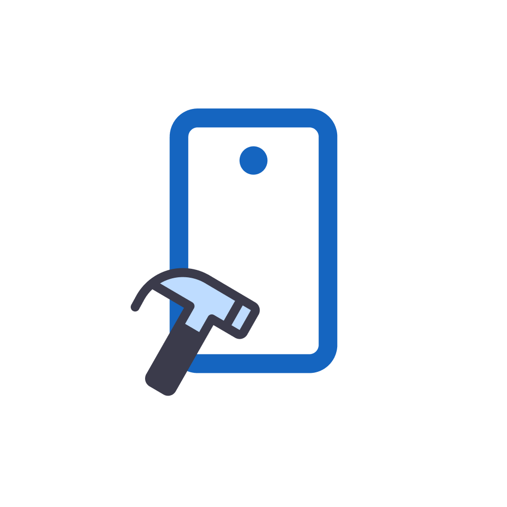

This macOS demo is running in Release Mode [v0.2.0](https://github.com/dungngminh/app_creaty/releases/tag/0.2.0) (forward x1.5).
[![style: very good analysis][very_good_analysis_badge]][very_good_analysis_link]

[![License: MIT][license_badge]][license_link]

# App Creaty - Drag n Drop Mobile Development Tool

Drag n Drop Mobile Development Tool created by [@dungngminh](https://github.com/dungngminh).

## Getting Started 🤖
- This idea came from [FlutterFlow](https://flutterflow.io) but will be a Desktop App.

## Features 🔥
- Create and sync project in local.
- Sync to Supabase (WIP).
- Drag n Drop Widget:
  - Add Widget to Tree.
  - Change properties of Widget.
  - Delete Widget.
  - Wrap in child to parent (WIP).
  - Support callback.(WIP)
- Widget Tree (WIP)
- Generate source code by widgets (WIP)
- Assets Manager (WIP)
- Preview app via local internet (WIP)
- Build apk file (WIP).
## What I used 💪
- Adjusted Flutter Widget pure Dart classes (Thanks [@rodydavis](https://github.com/rodydavis) for original version) in project's local package.
- Recursive Algorithm (will optimize soon to fit with Composite Pattern).
- Adjusted [device_frame](https://pub.dev/packages/device_preview) in project's local package.
- Material 3.
- [Supabase](https://supabase.com/) for backend side.
## How can I run this app? 🚀
- Will updated soon

## Platform 📦

- [X] Linux
- [X] macOS
- [ ] Windows

## Supported Widgets 🤖
- `Text`
- `Scaffold`
- `Column`
- `Row`
- `Container`
- `ElevatedButton`
- `Image`: `AssetImage`, `NetworkImage`
- ... to be continue

## Contributors 🌟

<table>
  <tr>
    <td align="center"> <b>Nguyen Minh Dung</b></a> <a href="https://github.com/dungngminh/app_creaty/commits?author=dungngminh" title="Maintainer">💻</a> 
</tr>
</table>

[license_badge]: https://img.shields.io/badge/license-MIT-blue.svg
[license_link]: https://opensource.org/licenses/MIT
[very_good_analysis_badge]: https://img.shields.io/badge/style-very_good_analysis-B22C89.svg
[very_good_analysis_link]: https://pub.dev/packages/very_good_analysis
